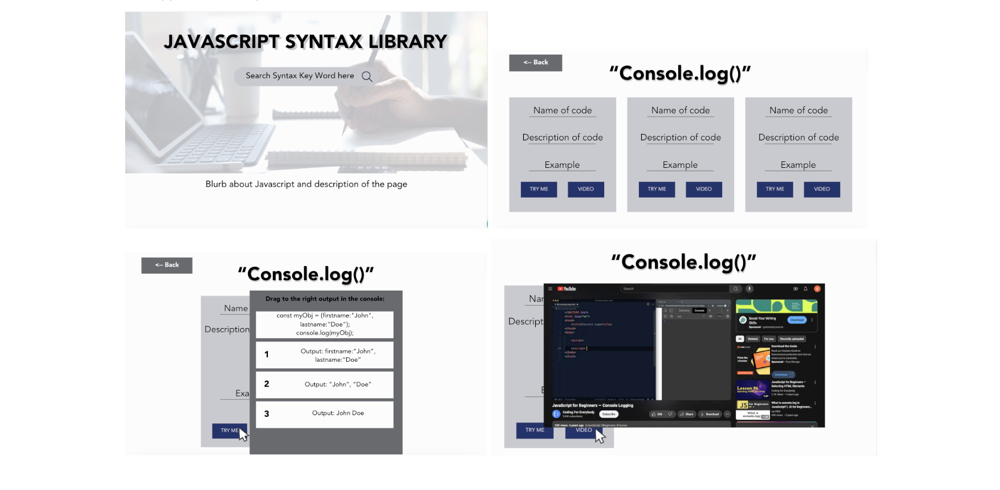

# Syntax Library
## What is it? 
A library for Java script synatx and respositories. 
## Who is this for? 
For beginner developers in their first year of coding.
## Why do i need it? 
Valuable resources to explain Javascript syntax that we struggle and have encountered

## User Story
As A Student i need help with syntax into my journey of programing

I Want a useful resource where i can search for syntax and help me identify its meaning

## Welcome
In this repository you will be presented with photos that show the deployed Syntax Library and its functionality!

## First page 

* Red Arrow: Search Button, When this is clicked on and there is no content inside the search button you will be presented with this prompt

* Blue Arrow: is search bar where the user will input

* Green Arrow: Button that will link you to the github repository  

## Second page 
(photo of second image)

## Server sides 
* Jquery () 
* icanhazdadjoke.com

## CSS Framework
* Bulma
* Bootstrap

## RESOURCES
* Link to background/Card image for directory.html > https://www.pexels.com/search/library%20background/ 
* Youtube > https://developers.google.com/youtube/v3/docs/search/list?apix_params=%7B%22q%22%3A%22javascript%22%7D 
* Font shadow for the title > https://www.fontspace.com/category/shadow
* Custom CSS > https://www.shecodes.io/athena/9852-how-to-add-a-custom-font-to-your-css-code 

## DEPLOYED LINK
* https://ohkrah.github.io/Project-1-/

## Repository Link
* https://github.com/Ohkrah/Project-1-.git

## Colaboration 
* Brayden  Wolkoys (https://github.com/bwolkoys)
* Dion Cob–Thornhill  (Githublink)
* Parisa Daily (https://github.com/pada2024)
* Silvia Villalba (https://github.com/S-via)

